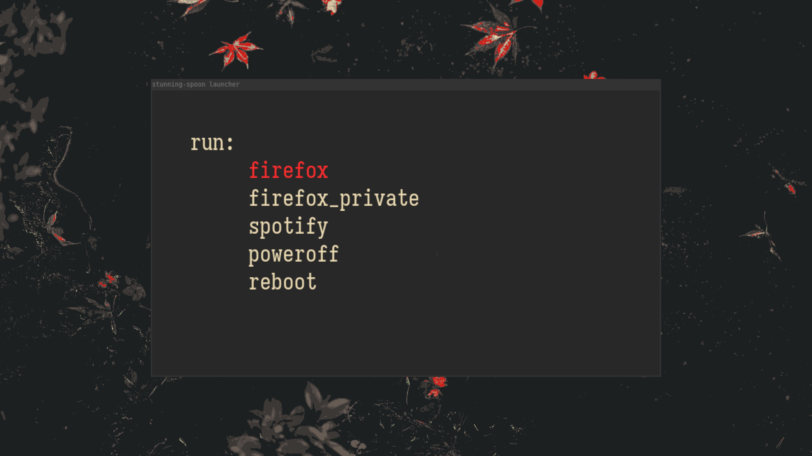

**stunning-spoon (beta v1.0.0)**

A simple and customizable opengl launcher based on dmenu.

>[!WARNING] 
>For now this is supported only on linux, windows support will come
>later


# Build instructions

### Required dependencies
- `git` for cloning this repository
- `gl.h` which is available in your GPU drivers, and also `glfw` needs to be installed (dependencies)
- `cmake` for building this project.
- `nvim` or `vim`, your favourite text editor.


### Compilation guide

Get hold of the binary using these commands
```bash
git clone git@github.com:blameaniket/stunning-spoon.git
cd <directory>
mkdir build && cd build/ && cmake .. && cd ..
cmake --build build
```

After compilation run the app using this command:
```bash
./build/app
```


# Configuration

You can directly configure the look of the launcher from the `src/main.c` file. The thing you can also configure is the entries part. You can put whatever entries you want like a bookmark. to configure the entries, edit the `config_entries` file.

An example `config_entries` file would be:
```text
firefox: firefox
discord: /usr/sbin/vesktop
poweroff: poweroff
reboot: reboot
```

In the entry `discord: /usr/sbin/vesktop`, `discord` appears on the launcher and the command that gets executed is `/usr/sbin/vesktop`.


# License
MIT
